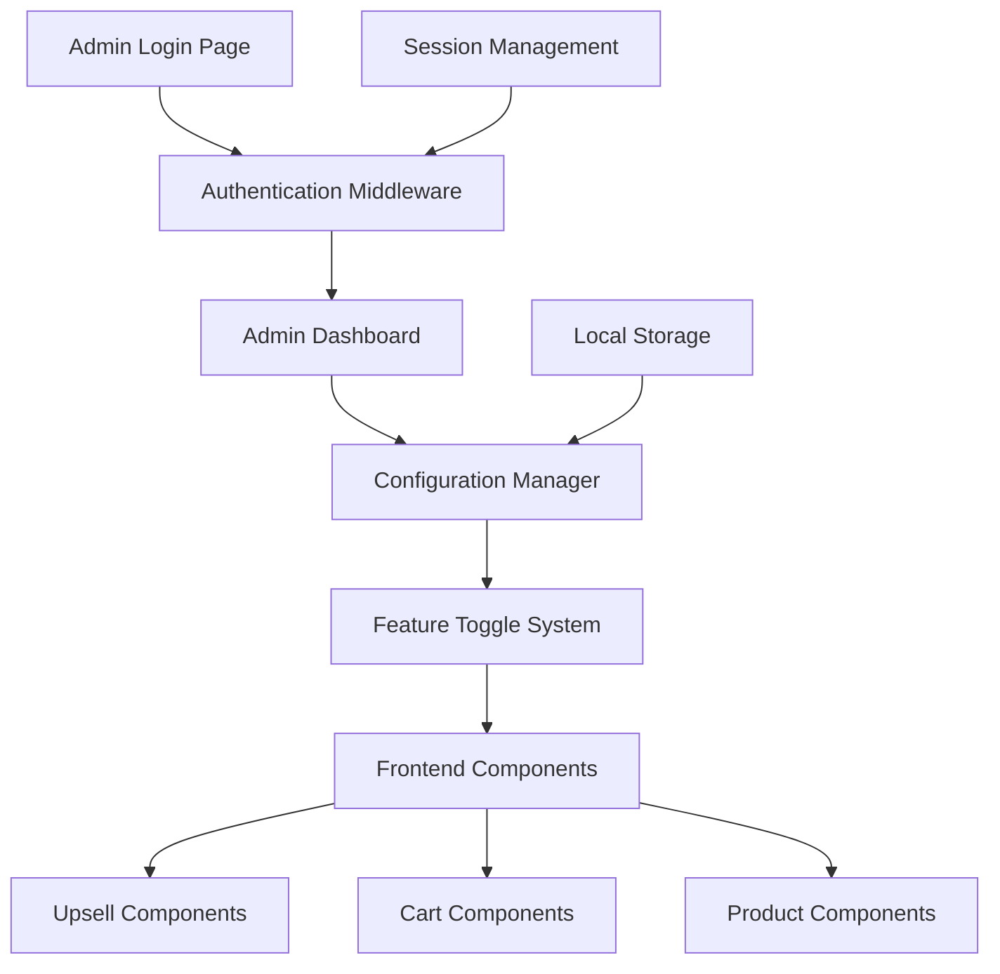
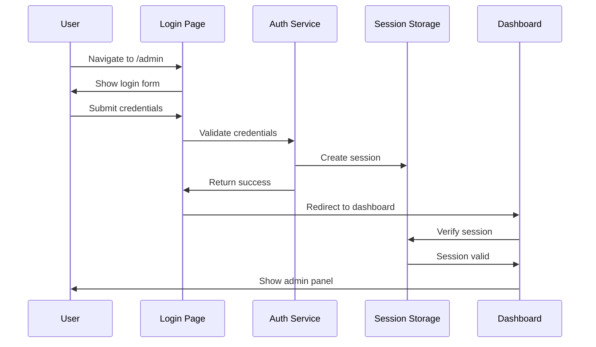

# Design Document

## Overview

The admin optimization system will create a secure, password-protected admin panel that allows store administrators to configure various upselling and cross-selling features throughout the CoffeeCraft website. The system will be built using Next.js with TypeScript, leveraging existing UI components and patterns while introducing new configuration management capabilities.

## Architecture

### High-Level Architecture



### Authentication Flow



## Components and Interfaces

### Core Types

```typescript
// Admin Configuration Types
interface AdminConfig {
  upselling: {
    frequentlyBoughtTogether: boolean
    youMightAlsoLike: boolean
    freeShippingProgressBar: boolean
    postCartUpsellOffers: boolean
    crossSellRecommendations: boolean
  }
  session: {
    isAuthenticated: boolean
    expiresAt: Date
    lastActivity: Date
  }
}

interface AdminSession {
  isAuthenticated: boolean
  expiresAt: Date
  lastActivity: Date
}

interface FeatureToggle {
  id: string
  name: string
  description: string
  enabled: boolean
  category: 'upselling' | 'cart' | 'product'
}
```

### Authentication Service

```typescript
class AdminAuthService {
  private static readonly USERNAME = 'user'
  private static readonly PASSWORD = 'password'
  private static readonly SESSION_DURATION = 30 * 60 * 1000 // 30 minutes
  
  static authenticate(username: string, password: string): boolean
  static createSession(): AdminSession
  static validateSession(): boolean
  static refreshSession(): void
  static logout(): void
}
```

### Configuration Manager

```typescript
class ConfigurationManager {
  private config: AdminConfig
  
  constructor()
  getConfig(): AdminConfig
  updateFeature(featureId: string, enabled: boolean): void
  saveConfig(): void
  loadConfig(): AdminConfig
  resetToDefaults(): void
}
```

## Data Models

### Configuration Storage

The admin configuration will be stored in localStorage with the following structure:

```json
{
  "adminConfig": {
    "upselling": {
      "frequentlyBoughtTogether": true,
      "youMightAlsoLike": true,
      "freeShippingProgressBar": true,
      "postCartUpsellOffers": true,
      "crossSellRecommendations": true
    },
    "lastUpdated": "2025-01-17T10:30:00Z"
  },
  "adminSession": {
    "isAuthenticated": true,
    "expiresAt": "2025-01-17T11:00:00Z",
    "lastActivity": "2025-01-17T10:30:00Z"
  }
}
```

### Feature Toggle Definitions

```typescript
const FEATURE_TOGGLES: FeatureToggle[] = [
  {
    id: 'frequentlyBoughtTogether',
    name: 'Frequently Bought Together',
    description: 'Show bundle offers on product pages with related items',
    enabled: true,
    category: 'product'
  },
  {
    id: 'youMightAlsoLike',
    name: 'You Might Also Like',
    description: 'Display product recommendations in cart and checkout',
    enabled: true,
    category: 'cart'
  },
  {
    id: 'freeShippingProgressBar',
    name: 'Free Shipping Progress Bar',
    description: 'Show progress toward free shipping threshold in cart',
    enabled: true,
    category: 'cart'
  },
  {
    id: 'postCartUpsellOffers',
    name: 'Post-Cart Upsell Offers',
    description: 'Show special offers after adding items to cart',
    enabled: true,
    category: 'upselling'
  },
  {
    id: 'crossSellRecommendations',
    name: 'Cross-sell Recommendations',
    description: 'Display related product suggestions throughout the site',
    enabled: true,
    category: 'upselling'
  }
]
```

## Error Handling

### Authentication Errors

- Invalid credentials: Display error message, allow retry with rate limiting
- Session expired: Redirect to login with informative message
- Multiple failed attempts: Implement basic rate limiting (5 attempts per 15 minutes)

### Configuration Errors

- Save failures: Show error toast, allow retry
- Load failures: Fall back to default configuration
- Invalid data: Validate and sanitize before saving

### Component Error Boundaries

```typescript
class AdminErrorBoundary extends React.Component {
  // Handle errors in admin components gracefully
  // Log errors for debugging
  // Show fallback UI
}
```

## Testing Strategy

### Unit Tests

- Authentication service methods
- Configuration manager functionality
- Feature toggle logic
- Component rendering with different configurations

### Integration Tests

- Login flow end-to-end
- Configuration changes affecting frontend components
- Session management and expiration
- Feature toggle state persistence

### Component Tests

- Admin dashboard rendering
- Feature toggle interactions
- Form validation and submission
- Error state handling

### Manual Testing Scenarios

1. **Authentication Flow**
   - Valid login credentials
   - Invalid login credentials
   - Session expiration
   - Logout functionality

2. **Configuration Management**
   - Toggle features on/off
   - Save and persist changes
   - Reset to defaults
   - Configuration validation

3. **Frontend Integration**
   - Verify features show/hide based on configuration
   - Test all upselling components respond to toggles
   - Ensure no broken UI when features are disabled

## Security Considerations

### Authentication Security

- Hardcoded credentials for simplicity (as requested)
- Session-based authentication with expiration
- Basic rate limiting for login attempts
- Secure session storage

### Data Protection

- Configuration stored locally (no sensitive data)
- Session data cleared on logout
- No external API calls for authentication

### Access Control

- Admin routes protected by authentication middleware
- Navigation link hidden from public view
- Direct URL access blocked without authentication

## Performance Considerations

### Lazy Loading

- Admin components loaded only when needed
- Configuration loaded on-demand
- Feature toggle checks optimized

### Caching Strategy

- Configuration cached in memory after first load
- Session validation cached with periodic refresh
- Component memoization for admin UI

### Bundle Optimization

- Admin code split from main application bundle
- Minimal impact on public-facing performance
- Tree-shaking for unused admin features

## Implementation Phases

### Phase 1: Authentication System
- Create login page and authentication service
- Implement session management
- Add route protection middleware

### Phase 2: Admin Dashboard
- Build main admin interface
- Create configuration management system
- Implement feature toggle UI

### Phase 3: Frontend Integration
- Update existing components to respect configuration
- Add conditional rendering based on feature toggles
- Test all upselling features

### Phase 4: Polish and Testing
- Add error handling and validation
- Implement responsive design
- Comprehensive testing and bug fixes