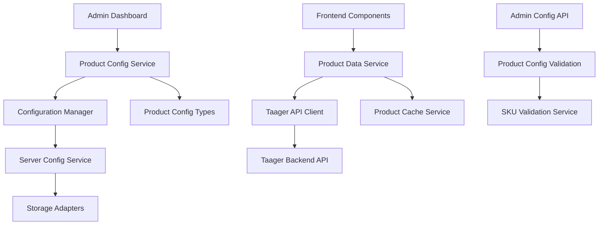

# Design Document

## Overview

The Dynamic Product Configuration system integrates with the Taager backend API to enable administrators to configure which product SKUs appear in different sections of the website. The system extends the existing admin configuration architecture to include product configuration management, API credential storage, and dynamic product data fetching.

The solution leverages the existing `ConfigurationManager` and `ServerConfigService` architecture, adding new configuration sections for product SKUs and API credentials while maintaining the same storage patterns (server-first with localStorage fallback).

## Architecture

### High-Level Architecture



### Data Flow

1. **Configuration Flow**: Admin configures SKUs → Product Config Service → Configuration Manager → Storage
2. **Display Flow**: Component requests product → Product Data Service → Taager API → Cache → Component
3. **Validation Flow**: SKU input → SKU Validation Service → Taager API → Validation result

## Components and Interfaces

### 1. Extended Admin Configuration Types

```typescript
// Extension to existing AdminConfig
interface AdminConfig {
  upselling: {
    // existing fields...
  }
  productConfiguration: ProductConfiguration
  taagerApi: TaagerApiConfig
  lastUpdated: string
}

interface ProductConfiguration {
  homePagePrimary: string | null           // Single SKU for home page
  recommendations: string[]                // Up to 3 SKUs
  frequentlyBoughtTogether: string[]       // Up to 3 SKUs per product
  upsellOffers: string[]                   // Multiple SKUs for post-checkout
  crossSellRecommendations: string[]       // Multiple SKUs for cross-sell
}

interface TaagerApiConfig {
  apiKey: string | null
  taagerId: number | null
  baseUrl: string
  country: string
  isConfigured: boolean
  lastValidated: string | null
}
```

### 2. Taager API Client

```typescript
interface TaagerApiClient {
  // Core methods
  getVariantGroup(variantId: string): Promise<VariantGroup>
  searchVariantGroups(params: SearchParams): Promise<SearchVariantsResponse>
  validateCredentials(): Promise<boolean>
  
  // Batch operations
  getMultipleVariantGroups(variantIds: string[]): Promise<VariantGroup[]>
  
  // Configuration
  configure(config: TaagerApiConfig): void
  isConfigured(): boolean
}

interface VariantGroup {
  id: string
  primaryVariant: ProductVariant
  variants: ProductVariant[]
  country: string
  // ... other fields from API response
}

interface ProductVariant {
  id: string
  productName: string
  name: { ar: string; en: string; id: string }
  description: { ar: string; en: string; id: string }
  productPrice: number
  productPicture: string
  extraImage1?: string
  // ... other fields from API response
}
```

### 3. Product Data Service

```typescript
interface ProductDataService {
  // Primary methods
  getHomePageProduct(): Promise<Product | null>
  getRecommendations(): Promise<Product[]>
  getFrequentlyBoughtTogether(productId?: string): Promise<Product[]>
  getUpsellOffers(): Promise<Product[]>
  getCrossSellRecommendations(): Promise<Product[]>
  
  // Cache management
  clearCache(): void
  refreshCache(): Promise<void>
  
  // Validation
  validateSku(sku: string): Promise<boolean>
  validateAllConfiguredSkus(): Promise<ValidationResult[]>
}

interface Product {
  id: string
  name: string
  description: string
  price: number
  image: string
  images: string[]
  rating?: number
  reviews?: number
  inStock: boolean
  specifications?: string
  // Mapped from Taager API response
}
```

### 4. Product Configuration Service

```typescript
interface ProductConfigurationService {
  // Configuration management
  getProductConfiguration(): Promise<ProductConfiguration>
  updateProductConfiguration(config: Partial<ProductConfiguration>): Promise<boolean>
  
  // SKU management
  setHomePagePrimary(sku: string): Promise<boolean>
  addRecommendation(sku: string): Promise<boolean>
  removeRecommendation(sku: string): Promise<boolean>
  
  // Validation
  validateConfiguration(): Promise<ConfigurationValidationResult>
  previewConfiguration(): Promise<ProductPreview[]>
  
  // API credentials
  setApiCredentials(credentials: TaagerApiConfig): Promise<boolean>
  validateApiCredentials(): Promise<boolean>
}
```

### 5. Admin UI Components

```typescript
// New admin components
interface ProductConfigurationPanel {
  // API Configuration section
  ApiCredentialsForm: React.Component
  
  // SKU Configuration sections
  HomePageConfiguration: React.Component
  RecommendationsConfiguration: React.Component
  FrequentlyBoughtTogetherConfiguration: React.Component
  UpsellConfiguration: React.Component
  
  // Validation and preview
  ConfigurationPreview: React.Component
  SkuValidationStatus: React.Component
}
```

## Data Models

### 1. Configuration Storage Schema

```typescript
// Extended from existing AdminConfig
const EXTENDED_DEFAULT_CONFIG = {
  upselling: {
    // existing upselling config...
  },
  productConfiguration: {
    homePagePrimary: null,
    recommendations: [],
    frequentlyBoughtTogether: [],
    upsellOffers: [],
    crossSellRecommendations: []
  },
  taagerApi: {
    apiKey: null,
    taagerId: null,
    baseUrl: 'https://public.api.taager.com',
    country: 'SAU',
    isConfigured: false,
    lastValidated: null
  },
  lastUpdated: new Date().toISOString()
}
```

### 2. Cache Schema

```typescript
interface ProductCache {
  products: Record<string, CachedProduct>
  lastUpdated: Record<string, string>
  expiryTimes: Record<string, number>
}

interface CachedProduct {
  data: Product
  cachedAt: string
  expiresAt: string
  source: 'taager-api'
}
```

### 3. Validation Results

```typescript
interface ValidationResult {
  sku: string
  isValid: boolean
  error?: string
  productName?: string
  lastChecked: string
}

interface ConfigurationValidationResult {
  isValid: boolean
  results: ValidationResult[]
  summary: {
    total: number
    valid: number
    invalid: number
    unchecked: number
  }
}
```

## Error Handling

### 1. API Error Handling

```typescript
class TaagerApiError extends Error {
  constructor(
    message: string,
    public statusCode: number,
    public endpoint: string,
    public originalError?: any
  ) {
    super(message)
    this.name = 'TaagerApiError'
  }
}

// Error handling strategy
const ERROR_HANDLING_STRATEGY = {
  // Network errors
  NETWORK_ERROR: 'fallback-to-cache',
  
  // Authentication errors
  AUTH_ERROR: 'show-config-prompt',
  
  // Rate limiting
  RATE_LIMIT: 'exponential-backoff',
  
  // Invalid SKU
  INVALID_SKU: 'remove-from-config',
  
  // Server errors
  SERVER_ERROR: 'retry-with-fallback'
}
```

### 2. Graceful Degradation

- **API Unavailable**: Show cached products or hide sections gracefully
- **Invalid SKUs**: Remove from configuration and log for admin review
- **Partial Failures**: Show available products, hide failed ones
- **Configuration Errors**: Fall back to default/static content

### 3. Retry Logic

```typescript
const RETRY_CONFIG = {
  maxAttempts: 3,
  baseDelay: 1000,
  maxDelay: 10000,
  backoffMultiplier: 2,
  retryableErrors: [408, 429, 500, 502, 503, 504]
}
```

## Testing Strategy

### 1. Unit Tests

- **TaagerApiClient**: Mock API responses, test error handling
- **ProductDataService**: Test caching, fallback logic
- **ProductConfigurationService**: Test validation, configuration updates
- **Components**: Test rendering with different data states

### 2. Integration Tests

- **API Integration**: Test actual Taager API calls (with test credentials)
- **Configuration Flow**: Test end-to-end configuration updates
- **Cache Behavior**: Test cache invalidation and refresh
- **Error Scenarios**: Test various failure modes

### 3. E2E Tests

- **Admin Configuration**: Test complete admin workflow
- **Product Display**: Test product rendering on frontend
- **Fallback Behavior**: Test behavior when API is unavailable
- **Performance**: Test loading times with various data sizes

### 4. Test Data Strategy

```typescript
// Mock data for testing
const MOCK_TAAGER_RESPONSES = {
  validProduct: { /* valid API response */ },
  invalidSku: { error: 'Product not found' },
  rateLimited: { error: 'Rate limit exceeded' },
  serverError: { error: 'Internal server error' }
}

const TEST_CONFIGURATIONS = {
  minimal: { homePagePrimary: 'TEST001' },
  complete: { /* all sections configured */ },
  invalid: { homePagePrimary: 'INVALID_SKU' }
}
```

## Performance Considerations

### 1. Caching Strategy

- **Product Data**: Cache for 1 hour, refresh in background
- **Configuration**: Cache indefinitely, invalidate on updates
- **API Responses**: Cache successful responses, don't cache errors
- **Images**: Leverage Next.js image optimization

### 2. Loading Optimization

- **Lazy Loading**: Load product data only when sections are visible
- **Batch Requests**: Combine multiple SKU requests when possible
- **Preloading**: Preload critical products (home page primary)
- **Fallback Content**: Show skeleton loaders during API calls

### 3. Bundle Size Optimization

- **Code Splitting**: Separate admin components from frontend
- **Tree Shaking**: Import only needed API client methods
- **Dynamic Imports**: Load Taager client only when needed

## Security Considerations

### 1. API Credential Storage

- **Encryption**: Encrypt API keys in storage adapters
- **Access Control**: Restrict API credential access to authenticated admins
- **Validation**: Validate credentials before storage
- **Rotation**: Support API key rotation

### 2. Input Validation

- **SKU Format**: Validate SKU format before API calls
- **Configuration Limits**: Enforce limits on number of SKUs per section
- **Sanitization**: Sanitize all user inputs
- **Rate Limiting**: Implement client-side rate limiting

### 3. Error Information

- **Error Masking**: Don't expose internal API errors to frontend
- **Logging**: Log security-relevant events
- **Monitoring**: Monitor for unusual API usage patterns

## Migration Strategy

### 1. Configuration Migration

```typescript
// Extend existing configuration migration
const MIGRATION_STEPS = [
  {
    version: '1.1.0',
    migrate: (config: any) => ({
      ...config,
      productConfiguration: EXTENDED_DEFAULT_CONFIG.productConfiguration,
      taagerApi: EXTENDED_DEFAULT_CONFIG.taagerApi
    })
  }
]
```

### 2. Backward Compatibility

- **Existing Components**: Continue to work with static data if no configuration
- **Feature Flags**: Use existing feature toggle system
- **Gradual Rollout**: Enable sections incrementally
- **Fallback Behavior**: Default to current static behavior

### 3. Data Validation

- **Schema Validation**: Validate configuration structure on load
- **Data Repair**: Auto-repair invalid configurations
- **Version Tracking**: Track configuration schema version
- **Rollback Support**: Support rolling back to previous configurations