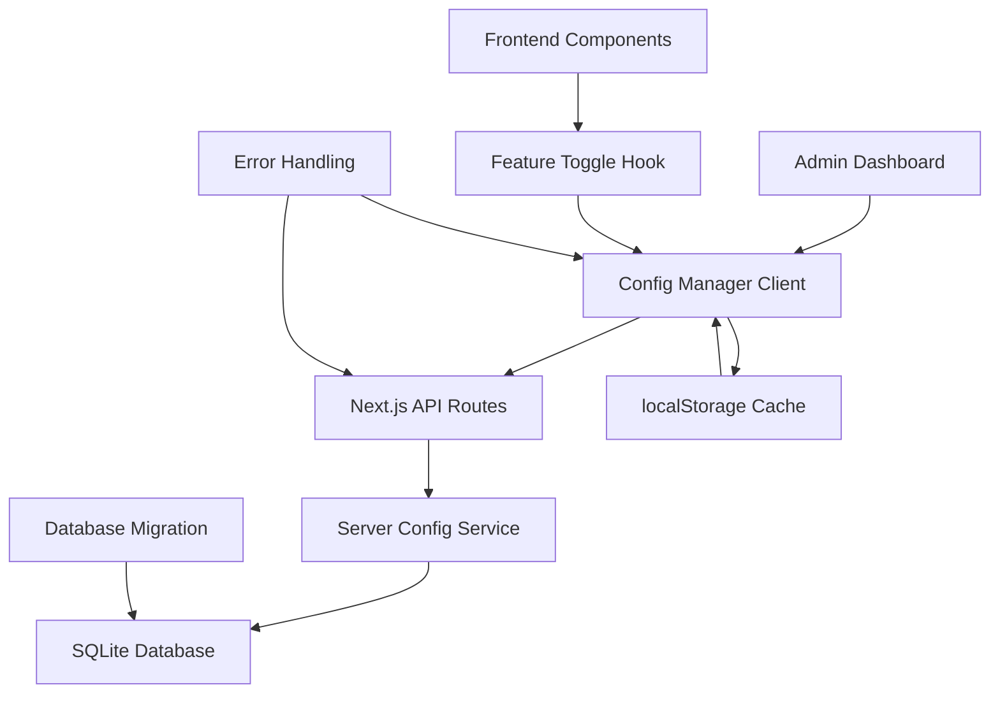
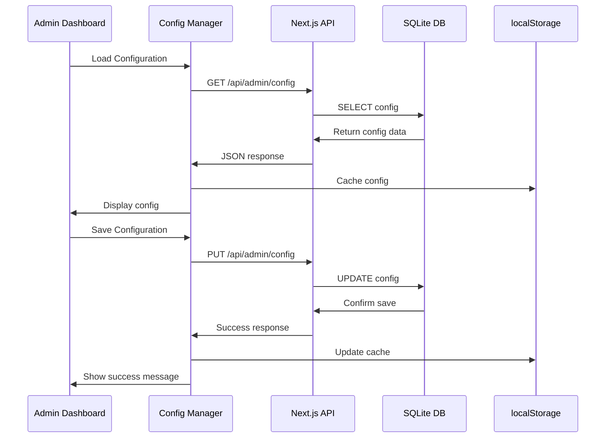

# Design Document

## Overview

This feature will implement server-side configuration storage using SQLite database with Next.js API routes. The system will maintain a hybrid approach where server storage is primary, with localStorage as fallback/cache. The SQLite database will be a single file that deploys with the application, requiring no external database setup.

## Architecture

### High-Level Architecture



### API Flow



## Components and Interfaces

### Database Schema

```sql
-- SQLite Schema
CREATE TABLE IF NOT EXISTS admin_config (
  id INTEGER PRIMARY KEY AUTOINCREMENT,
  config_data TEXT NOT NULL,  -- JSON string of AdminConfig
  created_at DATETIME DEFAULT CURRENT_TIMESTAMP,
  updated_at DATETIME DEFAULT CURRENT_TIMESTAMP,
  version INTEGER DEFAULT 1
);

CREATE TABLE IF NOT EXISTS config_audit (
  id INTEGER PRIMARY KEY AUTOINCREMENT,
  action TEXT NOT NULL,  -- 'UPDATE', 'RESET', 'CREATE'
  config_data TEXT,      -- JSON snapshot
  timestamp DATETIME DEFAULT CURRENT_TIMESTAMP,
  user_agent TEXT
);
```

### API Endpoints

```typescript
// /app/api/admin/config/route.ts
export async function GET(): Promise<Response>
export async function PUT(request: Request): Promise<Response>

// /app/api/admin/config/reset/route.ts  
export async function POST(): Promise<Response>

// /app/api/admin/health/route.ts
export async function GET(): Promise<Response>
```

### Server Configuration Service

```typescript
interface ServerConfigService {
  // Core operations
  getConfig(): Promise<AdminConfig>
  saveConfig(config: AdminConfig): Promise<boolean>
  resetToDefaults(): Promise<AdminConfig>
  
  // Database operations
  initializeDatabase(): Promise<void>
  migrateDatabase(): Promise<void>
  
  // Audit operations
  logConfigChange(action: string, config: AdminConfig): Promise<void>
  getAuditLog(): Promise<ConfigAuditEntry[]>
  
  // Health checks
  checkDatabaseHealth(): Promise<boolean>
}
```

### Updated Configuration Manager

```typescript
class ConfigurationManager {
  private static config: AdminConfig | null = null
  private static isServerAvailable: boolean = true
  
  // Primary methods (now server-first)
  static async getConfig(): Promise<AdminConfig>
  static async saveConfig(config: AdminConfig): Promise<boolean>
  static async resetToDefaults(): Promise<AdminConfig>
  
  // Fallback methods
  static getConfigFromCache(): AdminConfig
  static saveConfigToCache(config: AdminConfig): void
  
  // Sync methods
  static async syncWithServer(): Promise<boolean>
  static async checkServerHealth(): Promise<boolean>
}
```

## Data Models

### SQLite Database Structure

```typescript
interface ConfigRecord {
  id: number
  config_data: string  // JSON.stringify(AdminConfig)
  created_at: string
  updated_at: string
  version: number
}

interface ConfigAuditEntry {
  id: number
  action: 'UPDATE' | 'RESET' | 'CREATE'
  config_data: string
  timestamp: string
  user_agent: string
}
```

### API Response Types

```typescript
interface ConfigApiResponse {
  success: boolean
  data?: AdminConfig
  error?: string
  timestamp: string
}

interface HealthCheckResponse {
  database: boolean
  timestamp: string
  version: string
}
```

## Database Management

### SQLite Setup

```typescript
// lib/db/connection.ts
import Database from 'better-sqlite3'
import path from 'path'

const DB_PATH = path.join(process.cwd(), 'data', 'admin.db')

export function getDatabase(): Database.Database {
  const db = new Database(DB_PATH)
  db.pragma('journal_mode = WAL')  // Better performance
  return db
}
```

### Migration Strategy

```typescript
// lib/db/migrations.ts
const MIGRATIONS = [
  {
    version: 1,
    sql: `
      CREATE TABLE IF NOT EXISTS admin_config (
        id INTEGER PRIMARY KEY AUTOINCREMENT,
        config_data TEXT NOT NULL,
        created_at DATETIME DEFAULT CURRENT_TIMESTAMP,
        updated_at DATETIME DEFAULT CURRENT_TIMESTAMP,
        version INTEGER DEFAULT 1
      );
    `
  },
  {
    version: 2,
    sql: `
      CREATE TABLE IF NOT EXISTS config_audit (
        id INTEGER PRIMARY KEY AUTOINCREMENT,
        action TEXT NOT NULL,
        config_data TEXT,
        timestamp DATETIME DEFAULT CURRENT_TIMESTAMP,
        user_agent TEXT
      );
    `
  }
]
```

## Error Handling

### Server-Side Error Handling

```typescript
class ConfigError extends Error {
  constructor(
    message: string,
    public code: string,
    public statusCode: number = 500
  ) {
    super(message)
    this.name = 'ConfigError'
  }
}

// Error types
const CONFIG_ERRORS = {
  DATABASE_CONNECTION: 'DATABASE_CONNECTION',
  INVALID_CONFIG: 'INVALID_CONFIG',
  SAVE_FAILED: 'SAVE_FAILED',
  NOT_FOUND: 'NOT_FOUND'
} as const
```

### Client-Side Fallback Strategy

```typescript
class ConfigurationManager {
  static async getConfig(): Promise<AdminConfig> {
    try {
      // Try server first
      const serverConfig = await this.getConfigFromServer()
      this.saveConfigToCache(serverConfig)
      return serverConfig
    } catch (error) {
      console.warn('Server unavailable, using cache:', error)
      // Fallback to localStorage
      return this.getConfigFromCache()
    }
  }
}
```

## Performance Considerations

### Caching Strategy

- **Server Response Caching**: Cache API responses for 30 seconds
- **localStorage Sync**: Update localStorage after successful server operations
- **Connection Pooling**: Reuse SQLite connections efficiently
- **Lazy Loading**: Load configuration only when needed

### Database Optimization

```sql
-- Indexes for better performance
CREATE INDEX IF NOT EXISTS idx_config_updated_at ON admin_config(updated_at);
CREATE INDEX IF NOT EXISTS idx_audit_timestamp ON config_audit(timestamp);
```

## Security Considerations

### API Security

- Authentication middleware for all admin API routes
- Input validation and sanitization
- Rate limiting for API endpoints
- CORS configuration for admin routes

### Database Security

- SQLite file permissions (read/write for app only)
- SQL injection prevention using prepared statements
- Configuration data validation before storage
- Audit logging for security monitoring

## Deployment Considerations

### File Structure

```
/data/
  └── admin.db          # SQLite database file
/app/api/admin/
  ├── config/route.ts
  ├── config/reset/route.ts
  └── health/route.ts
/lib/
  ├── db/
  │   ├── connection.ts
  │   ├── migrations.ts
  │   └── schema.sql
  └── services/
      └── server-config-service.ts
```

### Environment Variables

```env
# Optional: Custom database path
DATABASE_PATH=./data/admin.db

# Optional: Enable database logging
DB_LOGGING=false

# Optional: Database backup interval
DB_BACKUP_INTERVAL=24h
```

## Testing Strategy

### Unit Tests

- Database connection and operations
- API route handlers
- Configuration validation
- Error handling scenarios

### Integration Tests

- End-to-end configuration flow
- Fallback mechanism testing
- Database migration testing
- API authentication testing

### Performance Tests

- Database query performance
- API response times
- Concurrent access handling
- Large configuration handling

## Migration from localStorage

### Migration Strategy

1. **Detect existing localStorage config**
2. **Migrate to server on first admin login**
3. **Maintain localStorage as cache**
4. **Gradual phase-out of localStorage dependency**

```typescript
async function migrateFromLocalStorage(): Promise<void> {
  const localConfig = localStorage.getItem('adminConfig')
  if (localConfig && !await this.hasServerConfig()) {
    const config = JSON.parse(localConfig)
    await this.saveConfigToServer(config)
    console.log('Migrated config from localStorage to server')
  }
}
```