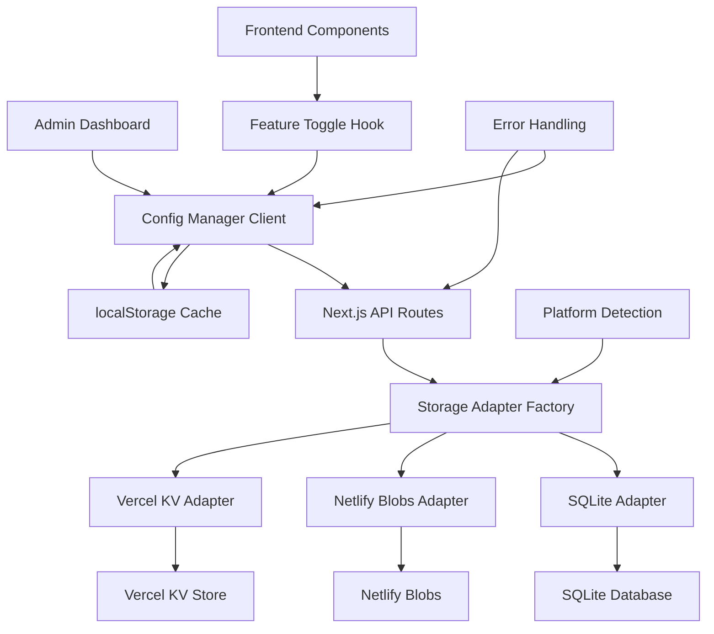
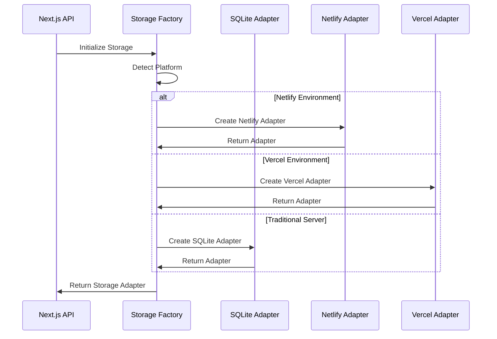
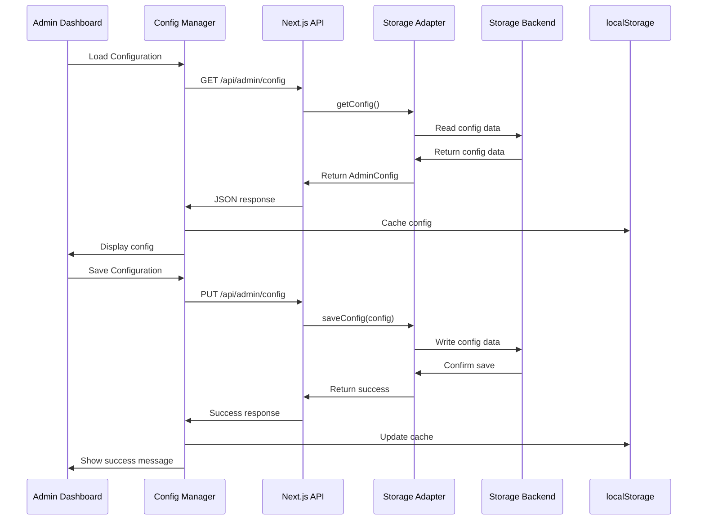

# Design Document

## Overview

This feature will implement server-side configuration storage with platform-adaptive storage backends. The system will automatically detect the deployment environment and use the appropriate storage method: Netlify Blobs for Netlify deployments, Vercel KV for Vercel deployments, and SQLite for traditional server deployments. The system maintains a hybrid approach where server storage is primary, with localStorage as fallback/cache.

## Architecture

### High-Level Architecture



### Platform Detection Flow



### API Flow



## Components and Interfaces

### Storage Adapter Interface

```typescript
interface StorageAdapter {
  // Core operations
  getConfig(): Promise<AdminConfig | null>
  saveConfig(config: AdminConfig): Promise<boolean>
  resetToDefaults(): Promise<AdminConfig>
  
  // Storage operations
  initialize(): Promise<void>
  migrate(): Promise<void>
  
  // Audit operations
  logConfigChange(action: string, config: AdminConfig, userAgent?: string): Promise<void>
  getAuditLog(): Promise<ConfigAuditEntry[]>
  
  // Health checks
  checkHealth(): Promise<boolean>
  
  // Platform info
  getPlatformInfo(): PlatformInfo
}
```

### Platform Detection

```typescript
enum PlatformType {
  NETLIFY = 'netlify',
  VERCEL = 'vercel',
  SQLITE = 'sqlite'
}

interface PlatformInfo {
  type: PlatformType
  name: string
  supportsFileSystem: boolean
  storageType: string
}

class PlatformDetector {
  static detect(): PlatformType {
    // Check for Netlify environment
    if (process.env.NETLIFY || process.env.NETLIFY_DEV) {
      return PlatformType.NETLIFY
    }
    
    // Check for Vercel environment
    if (process.env.VERCEL || process.env.VERCEL_ENV) {
      return PlatformType.VERCEL
    }
    
    // Default to SQLite for traditional servers
    return PlatformType.SQLITE
  }
}
```

### Storage Adapter Factory

```typescript
class StorageAdapterFactory {
  static async createAdapter(): Promise<StorageAdapter> {
    const platform = PlatformDetector.detect()
    
    switch (platform) {
      case PlatformType.NETLIFY:
        return new NetlifyBlobsAdapter()
      case PlatformType.VERCEL:
        return new VercelKVAdapter()
      case PlatformType.SQLITE:
      default:
        return new SQLiteAdapter()
    }
  }
}
```

### Netlify Blobs Adapter

```typescript
class NetlifyBlobsAdapter implements StorageAdapter {
  private store: any // @netlify/blobs
  
  constructor() {
    this.store = getStore('admin-config')
  }
  
  async getConfig(): Promise<AdminConfig | null> {
    try {
      const configData = await this.store.get('config')
      return configData ? JSON.parse(configData) : null
    } catch (error) {
      console.error('Failed to get config from Netlify Blobs:', error)
      return null
    }
  }
  
  async saveConfig(config: AdminConfig): Promise<boolean> {
    try {
      await this.store.set('config', JSON.stringify(config))
      await this.logConfigChange('UPDATE', config)
      return true
    } catch (error) {
      console.error('Failed to save config to Netlify Blobs:', error)
      return false
    }
  }
  
  getPlatformInfo(): PlatformInfo {
    return {
      type: PlatformType.NETLIFY,
      name: 'Netlify Blobs',
      supportsFileSystem: false,
      storageType: 'blob'
    }
  }
}
```

### API Endpoints

```typescript
// /app/api/admin/config/route.ts
export async function GET(): Promise<Response>
export async function PUT(request: Request): Promise<Response>

// /app/api/admin/config/reset/route.ts  
export async function POST(): Promise<Response>

// /app/api/admin/health/route.ts
export async function GET(): Promise<Response>

// /app/api/admin/platform/route.ts
export async function GET(): Promise<Response>  // New: Platform info endpoint
```

### Server Configuration Service

```typescript
class ServerConfigService {
  private adapter: StorageAdapter
  
  constructor(adapter: StorageAdapter) {
    this.adapter = adapter
  }
  
  // Core operations
  async getConfig(): Promise<AdminConfig> {
    const config = await this.adapter.getConfig()
    return config || this.getDefaultConfig()
  }
  
  async saveConfig(config: AdminConfig): Promise<boolean> {
    return await this.adapter.saveConfig(config)
  }
  
  async resetToDefaults(): Promise<AdminConfig> {
    return await this.adapter.resetToDefaults()
  }
  
  // Platform operations
  async initialize(): Promise<void> {
    await this.adapter.initialize()
  }
  
  async checkHealth(): Promise<boolean> {
    return await this.adapter.checkHealth()
  }
  
  getPlatformInfo(): PlatformInfo {
    return this.adapter.getPlatformInfo()
  }
  
  private getDefaultConfig(): AdminConfig {
    // Return default admin configuration
    return {
      features: {},
      settings: {},
      version: 1
    }
  }
}
```

### Updated Configuration Manager

```typescript
class ConfigurationManager {
  private static config: AdminConfig | null = null
  private static isServerAvailable: boolean = true
  
  // Primary methods (now server-first)
  static async getConfig(): Promise<AdminConfig>
  static async saveConfig(config: AdminConfig): Promise<boolean>
  static async resetToDefaults(): Promise<AdminConfig>
  
  // Fallback methods
  static getConfigFromCache(): AdminConfig
  static saveConfigToCache(config: AdminConfig): void
  
  // Sync methods
  static async syncWithServer(): Promise<boolean>
  static async checkServerHealth(): Promise<boolean>
}
```

## Data Models

### Platform-Agnostic Data Models

```typescript
interface ConfigRecord {
  id: string | number
  config_data: string  // JSON.stringify(AdminConfig)
  created_at: string
  updated_at: string
  version: number
  platform: PlatformType
}

interface ConfigAuditEntry {
  id: string | number
  action: 'UPDATE' | 'RESET' | 'CREATE'
  config_data: string
  timestamp: string
  user_agent?: string
  platform: PlatformType
}
```

### Platform-Specific Storage Formats

```typescript
// Netlify Blobs Storage Format
interface NetlifyConfigBlob {
  config: AdminConfig
  metadata: {
    created_at: string
    updated_at: string
    version: number
  }
  audit: ConfigAuditEntry[]
}

// Vercel KV Storage Format
interface VercelConfigKV {
  'admin:config': string  // JSON.stringify(AdminConfig)
  'admin:metadata': string  // JSON.stringify(metadata)
  'admin:audit': string  // JSON.stringify(ConfigAuditEntry[])
}

// SQLite Database Structure (unchanged)
interface SQLiteConfigRecord {
  id: number
  config_data: string
  created_at: string
  updated_at: string
  version: number
}
```

### API Response Types

```typescript
interface ConfigApiResponse {
  success: boolean
  data?: AdminConfig
  error?: string
  timestamp: string
  platform?: PlatformInfo
}

interface HealthCheckResponse {
  storage: boolean
  platform: PlatformInfo
  timestamp: string
  version: string
}

interface PlatformInfoResponse {
  platform: PlatformInfo
  capabilities: {
    supportsAudit: boolean
    supportsBackup: boolean
    maxConfigSize: number
  }
}
```

## Storage Management

### Platform-Specific Storage Setup

```typescript
// Netlify Blobs Setup
import { getStore } from '@netlify/blobs'

export function getNetlifyStore() {
  return getStore('admin-config')
}

// Vercel KV Setup  
import { kv } from '@vercel/kv'

export function getVercelKV() {
  return kv
}

// SQLite Setup (for traditional servers)
import Database from 'better-sqlite3'
import path from 'path'

const DB_PATH = path.join(process.cwd(), 'data', 'admin.db')

export function getDatabase(): Database.Database {
  const db = new Database(DB_PATH)
  db.pragma('journal_mode = WAL')  // Better performance
  return db
}
```

### Platform-Adaptive Migration Strategy

```typescript
// lib/storage/migrations.ts
interface MigrationStrategy {
  version: number
  platform: PlatformType
  migrate(adapter: StorageAdapter): Promise<void>
}

const MIGRATIONS: MigrationStrategy[] = [
  {
    version: 1,
    platform: PlatformType.SQLITE,
    async migrate(adapter: SQLiteAdapter) {
      const db = adapter.getDatabase()
      db.exec(`
        CREATE TABLE IF NOT EXISTS admin_config (
          id INTEGER PRIMARY KEY AUTOINCREMENT,
          config_data TEXT NOT NULL,
          created_at DATETIME DEFAULT CURRENT_TIMESTAMP,
          updated_at DATETIME DEFAULT CURRENT_TIMESTAMP,
          version INTEGER DEFAULT 1
        );
      `)
    }
  },
  {
    version: 1,
    platform: PlatformType.NETLIFY,
    async migrate(adapter: NetlifyBlobsAdapter) {
      // Initialize blob structure if needed
      const store = adapter.getStore()
      const existing = await store.get('config')
      if (!existing) {
        await store.set('config', JSON.stringify({}))
        await store.set('audit', JSON.stringify([]))
      }
    }
  },
  {
    version: 1,
    platform: PlatformType.VERCEL,
    async migrate(adapter: VercelKVAdapter) {
      // Initialize KV structure if needed
      const kv = adapter.getKV()
      const existing = await kv.get('admin:config')
      if (!existing) {
        await kv.set('admin:config', JSON.stringify({}))
        await kv.set('admin:audit', JSON.stringify([]))
      }
    }
  }
]

class MigrationManager {
  static async runMigrations(adapter: StorageAdapter): Promise<void> {
    const platform = adapter.getPlatformInfo().type
    const migrations = MIGRATIONS.filter(m => m.platform === platform)
    
    for (const migration of migrations) {
      try {
        await migration.migrate(adapter)
        console.log(`Migration ${migration.version} completed for ${platform}`)
      } catch (error) {
        console.error(`Migration ${migration.version} failed for ${platform}:`, error)
        throw error
      }
    }
  }
}
```

## Error Handling

### Platform-Adaptive Error Handling

```typescript
class ConfigError extends Error {
  constructor(
    message: string,
    public code: string,
    public platform: PlatformType,
    public statusCode: number = 500
  ) {
    super(message)
    this.name = 'ConfigError'
  }
}

// Platform-specific error types
const CONFIG_ERRORS = {
  // Common errors
  INVALID_CONFIG: 'INVALID_CONFIG',
  SAVE_FAILED: 'SAVE_FAILED',
  NOT_FOUND: 'NOT_FOUND',
  
  // SQLite specific
  DATABASE_CONNECTION: 'DATABASE_CONNECTION',
  DATABASE_LOCKED: 'DATABASE_LOCKED',
  
  // Netlify specific
  BLOB_QUOTA_EXCEEDED: 'BLOB_QUOTA_EXCEEDED',
  BLOB_ACCESS_DENIED: 'BLOB_ACCESS_DENIED',
  
  // Vercel specific
  KV_QUOTA_EXCEEDED: 'KV_QUOTA_EXCEEDED',
  KV_ACCESS_DENIED: 'KV_ACCESS_DENIED'
} as const

class ErrorHandler {
  static handleStorageError(error: any, platform: PlatformType): ConfigError {
    switch (platform) {
      case PlatformType.NETLIFY:
        if (error.message?.includes('quota')) {
          return new ConfigError('Netlify Blobs quota exceeded', CONFIG_ERRORS.BLOB_QUOTA_EXCEEDED, platform, 507)
        }
        if (error.message?.includes('access')) {
          return new ConfigError('Netlify Blobs access denied', CONFIG_ERRORS.BLOB_ACCESS_DENIED, platform, 403)
        }
        break
        
      case PlatformType.VERCEL:
        if (error.message?.includes('quota')) {
          return new ConfigError('Vercel KV quota exceeded', CONFIG_ERRORS.KV_QUOTA_EXCEEDED, platform, 507)
        }
        if (error.message?.includes('access')) {
          return new ConfigError('Vercel KV access denied', CONFIG_ERRORS.KV_ACCESS_DENIED, platform, 403)
        }
        break
        
      case PlatformType.SQLITE:
        if (error.message?.includes('database is locked')) {
          return new ConfigError('Database is locked', CONFIG_ERRORS.DATABASE_LOCKED, platform, 503)
        }
        if (error.message?.includes('no such table')) {
          return new ConfigError('Database connection failed', CONFIG_ERRORS.DATABASE_CONNECTION, platform, 500)
        }
        break
    }
    
    return new ConfigError('Storage operation failed', CONFIG_ERRORS.SAVE_FAILED, platform, 500)
  }
}
```

### Client-Side Fallback Strategy

```typescript
class ConfigurationManager {
  private static platformInfo: PlatformInfo | null = null
  
  static async getConfig(): Promise<AdminConfig> {
    try {
      // Try server first
      const serverConfig = await this.getConfigFromServer()
      this.saveConfigToCache(serverConfig)
      return serverConfig
    } catch (error) {
      const platform = await this.getPlatformInfo()
      console.warn(`${platform.name} unavailable, using cache:`, error)
      
      // Show platform-specific warning to user
      this.showPlatformWarning(platform, error)
      
      // Fallback to localStorage
      return this.getConfigFromCache()
    }
  }
  
  private static showPlatformWarning(platform: PlatformInfo, error: any) {
    const warnings = {
      [PlatformType.NETLIFY]: 'Netlify Blobs storage is temporarily unavailable. Using cached configuration.',
      [PlatformType.VERCEL]: 'Vercel KV storage is temporarily unavailable. Using cached configuration.',
      [PlatformType.SQLITE]: 'Database connection failed. Using cached configuration.'
    }
    
    // Show user-friendly warning based on platform
    console.warn(warnings[platform.type] || 'Server storage unavailable. Using cached configuration.')
  }
}
```

## Performance Considerations

### Platform-Adaptive Caching Strategy

- **Server Response Caching**: Cache API responses for 30 seconds across all platforms
- **localStorage Sync**: Update localStorage after successful server operations
- **Platform-Specific Optimizations**:
  - **SQLite**: Connection pooling and WAL mode for better performance
  - **Netlify Blobs**: Batch operations to minimize API calls
  - **Vercel KV**: Pipeline operations for multiple key updates
- **Lazy Loading**: Load configuration only when needed
- **Compression**: Compress large configuration objects before storage

### Platform-Specific Optimizations

```typescript
// SQLite Optimizations
const sqliteOptimizations = {
  connectionPool: true,
  walMode: true,
  indexes: [
    'CREATE INDEX IF NOT EXISTS idx_config_updated_at ON admin_config(updated_at)',
    'CREATE INDEX IF NOT EXISTS idx_audit_timestamp ON config_audit(timestamp)'
  ]
}

// Netlify Blobs Optimizations
const netlifyOptimizations = {
  batchSize: 10,
  compression: true,
  cacheHeaders: { 'Cache-Control': 'max-age=30' }
}

// Vercel KV Optimizations
const vercelOptimizations = {
  pipeline: true,
  ttl: 86400, // 24 hours
  compression: true
}
```

## Security Considerations

### API Security

- Authentication middleware for all admin API routes
- Input validation and sanitization
- Rate limiting for API endpoints
- CORS configuration for admin routes

### Database Security

- SQLite file permissions (read/write for app only)
- SQL injection prevention using prepared statements
- Configuration data validation before storage
- Audit logging for security monitoring

## Deployment Considerations

### Platform-Adaptive File Structure

```
/app/api/admin/
  ├── config/route.ts
  ├── config/reset/route.ts
  ├── health/route.ts
  └── platform/route.ts      # New: Platform info endpoint
/lib/
  ├── storage/
  │   ├── adapters/
  │   │   ├── sqlite-adapter.ts
  │   │   ├── netlify-adapter.ts
  │   │   └── vercel-adapter.ts
  │   ├── factory.ts
  │   ├── migrations.ts
  │   └── platform-detector.ts
  ├── db/                    # SQLite-specific (traditional servers only)
  │   ├── connection.ts
  │   └── schema.sql
  └── services/
      └── server-config-service.ts
/data/                       # SQLite database (traditional servers only)
  └── admin.db
```

### Platform-Specific Environment Variables

```env
# Platform Detection (auto-detected, but can be overridden)
FORCE_STORAGE_PLATFORM=sqlite|netlify|vercel

# SQLite Configuration (traditional servers)
DATABASE_PATH=./data/admin.db
DB_LOGGING=false

# Netlify Configuration (Netlify deployments)
NETLIFY_BLOBS_STORE_NAME=admin-config

# Vercel Configuration (Vercel deployments)
KV_REST_API_URL=your-kv-url
KV_REST_API_TOKEN=your-kv-token

# Common Configuration
CONFIG_CACHE_TTL=30
ENABLE_CONFIG_AUDIT=true
```

### Platform-Specific Deployment Notes

#### Netlify Deployment
- Requires `@netlify/blobs` package
- No file system persistence needed
- Automatic platform detection via `NETLIFY` environment variable
- Blobs storage is automatically provisioned

#### Vercel Deployment  
- Requires `@vercel/kv` package
- KV store must be provisioned in Vercel dashboard
- Automatic platform detection via `VERCEL` environment variable
- Environment variables automatically injected

#### Traditional Server Deployment
- Requires `better-sqlite3` package
- File system write permissions needed for `/data` directory
- SQLite database file persists across deployments
- Manual backup/restore procedures available

## Testing Strategy

### Platform-Adaptive Unit Tests

```typescript
// Test each storage adapter independently
describe('Storage Adapters', () => {
  describe('SQLiteAdapter', () => {
    test('should save and retrieve config')
    test('should handle database connection errors')
    test('should perform migrations correctly')
  })
  
  describe('NetlifyBlobsAdapter', () => {
    test('should save and retrieve config from blobs')
    test('should handle quota exceeded errors')
    test('should handle blob access errors')
  })
  
  describe('VercelKVAdapter', () => {
    test('should save and retrieve config from KV')
    test('should handle KV quota errors')
    test('should handle pipeline operations')
  })
})

// Test platform detection
describe('PlatformDetector', () => {
  test('should detect Netlify environment')
  test('should detect Vercel environment')
  test('should default to SQLite')
})
```

### Integration Tests

```typescript
describe('End-to-End Configuration Flow', () => {
  test('should load config from server and cache locally')
  test('should fallback to localStorage when server fails')
  test('should sync localStorage changes to server')
  test('should handle platform-specific errors gracefully')
})

describe('Platform Migration Tests', () => {
  test('should migrate from localStorage to Netlify Blobs')
  test('should migrate from localStorage to Vercel KV')
  test('should migrate from localStorage to SQLite')
})
```

### Performance Tests

```typescript
describe('Performance Tests', () => {
  test('should handle large configuration objects')
  test('should maintain acceptable response times across platforms')
  test('should handle concurrent access efficiently')
  test('should optimize platform-specific operations')
})
```

## Migration from localStorage

### Platform-Adaptive Migration Strategy

```typescript
class ConfigMigrationService {
  static async migrateFromLocalStorage(adapter: StorageAdapter): Promise<boolean> {
    try {
      // Check if localStorage has config
      const localConfig = localStorage.getItem('adminConfig')
      if (!localConfig) return false
      
      // Check if server already has config
      const serverConfig = await adapter.getConfig()
      if (serverConfig) return false // Already migrated
      
      // Parse and validate local config
      const config = JSON.parse(localConfig)
      if (!this.isValidConfig(config)) {
        console.warn('Invalid localStorage config, using defaults')
        return false
      }
      
      // Migrate to server
      const success = await adapter.saveConfig(config)
      if (success) {
        await adapter.logConfigChange('MIGRATE', config, 'localStorage-migration')
        console.log(`Migrated config from localStorage to ${adapter.getPlatformInfo().name}`)
        return true
      }
      
      return false
    } catch (error) {
      console.error('Migration from localStorage failed:', error)
      return false
    }
  }
  
  static isValidConfig(config: any): config is AdminConfig {
    return config && 
           typeof config === 'object' && 
           'features' in config && 
           'settings' in config
  }
  
  // Platform-specific migration helpers
  static async migrateToNetlify(config: AdminConfig): Promise<boolean> {
    const adapter = new NetlifyBlobsAdapter()
    await adapter.initialize()
    return await this.migrateFromLocalStorage(adapter)
  }
  
  static async migrateToVercel(config: AdminConfig): Promise<boolean> {
    const adapter = new VercelKVAdapter()
    await adapter.initialize()
    return await this.migrateFromLocalStorage(adapter)
  }
  
  static async migrateToSQLite(config: AdminConfig): Promise<boolean> {
    const adapter = new SQLiteAdapter()
    await adapter.initialize()
    return await this.migrateFromLocalStorage(adapter)
  }
}
```

### Migration Workflow

1. **Automatic Detection**: On first server request, check for localStorage config
2. **Platform-Specific Migration**: Use appropriate adapter based on deployment platform
3. **Validation**: Ensure migrated config is valid and complete
4. **Audit Trail**: Log migration event for tracking
5. **Cleanup**: Optionally clear localStorage after successful migration
6. **Fallback**: Maintain localStorage as backup during transition period

### Migration API Endpoint

```typescript
// /app/api/admin/migrate/route.ts
export async function POST(request: Request): Promise<Response> {
  try {
    const adapter = await StorageAdapterFactory.createAdapter()
    const migrated = await ConfigMigrationService.migrateFromLocalStorage(adapter)
    
    return Response.json({
      success: true,
      migrated,
      platform: adapter.getPlatformInfo(),
      timestamp: new Date().toISOString()
    })
  } catch (error) {
    return Response.json({
      success: false,
      error: error.message,
      timestamp: new Date().toISOString()
    }, { status: 500 })
  }
}
```